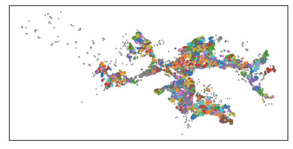

# Solar Energy in the City

**Open Data Hackdays – Shape my City -- Challenge 03**
**November 27 -- 28 2020**

## Introduction

Solar energy is often overlooked when old buildings are renovated or new buildings are constructed. 
However, every house that maintains its individual solar power station is less reliant on the public 
grid which in turn helps to lower energy costs for the residents. This makes solar energy a very 
interesting power source.

Given that the canton of Lucerne specified in 2019 that every new building is obliged to produce its 
own electricity, it is even more surprising that the rate of newly built solar power stations is quite 
low.

## Main objective
Our goal is to analyze all buildings within the city limits of Lucerne and identify clusters of those 
buildings which are outstandingly suitable for producing solar energy. Factors we will look at include 
(but are not limited to) the geographic location, the orientation of the building and the slope of the 
building's roof.

These clusters are then further analyzed (Which percentage of buildings already produce solar energy? 
How suitable are the remaining buildings?) in order to identify those areas in the city that are most 
attractive for the installation of a solar system. These insights can then be used to provide 
information about the framework conditions, the new legal framework and available public grants in 
order to raise the number of solar systems in the city.

The main data sources were:
* Solar Potential Register 
* Building and Apartment Register

Both datasets describe data in the region of the city of Lucerne. 

## Questions to be answered
* Which buildings have the highest energy output (kWh)?
* Density: Where are many buildings with high potential close together?
* Density 2: Where are many buildings with at least some potential close together?
* Ownership: Where are many buildings with all different owners close together?
* Which buildings do have potential and are not (re)constructed for many years?

**Filtering questions:**
* Which of those are only for electricity or only for thermal power?
* Which of those are under monumental protection?
* Which of those are not downtown?

## Pre-processing of the data
In order to start working with the data that has been gathered prior to the Hackathlon, we had to 
preprocess it accordingly. As mentioned above, the data basis provided for this project, came from 
two different sources. Therefore, a thorough preprocessing of both datasets was key. It was 
imperative to have all datasets in the same data type - and preferably .csv or .xlsx, since we have
received the data in many different shapes and data types. 

In a first step, the data provided by the solar potential register was preprocessed. Since the main 
goal is to provide one universal excel sheet to our challenge owner, this large dataset had to be 
reduced. First, we filtered by roof areas that have a promising solar potential. In another step,
we were able to group by the identification number of the buildings. This step was necessary in 
identifying the roofs because the dataset provided divided the roofs into different parts. With this 
step we were able to create a better overview per roof. However, this means that several other 
columns had to be summed up or taken the mean value of it in order to group the dataset by an ID. 

In a second step, the data provided by the building and apartment register had to be merged into one 
big dataset. We have received over ten different data sets from the building and apartment register. 
These different datasets came in many different shapes such as *.dsv*, *.shp*, *.prj*, or *.shx*. 
Once this was converted into the desired type, all these datasets were merged into one big dataset 
using R.

Ultimately, the two datasets were joined by an unique building identifier found on both datasets. 
This allowed us to add additional data from the building and apartment register. This preprocessing 
approach turned out to be the key to a successful accomplishment of this challenge. Afterwards,
the dataset was transformed as needed and some calculations were performed.

## Problems identified

### Existing solar panel
Although the obtained dataset from the building and apartment register contains a column that shows
whether a building already has a solar panel installed, it turned out during the preprocessing that 
the data quality was rather low. The values returned were either “N/A” or “0”, which means that it was 
unclear whether there was a solar panel, or there was certainly no solar panel installed. However, we
did not get any buildings that had solar panels installed, which was rather unlikely. Therefore, we 
were unable to identify and sort out buildings that already had solar panels and are not to be 
contacted.

## Results
The main goal of the challenge was to provide the challenge owner with an excel file that would help 
him promote the installation of solar panels.

## Outlook and further work

Since the desired product could be delivered in the form of an excel file and so the main goal was 
achieved, the group went on to cluster the buildings based on the following features:

* Photovoltaic yield per year (kWh/a)
* Total roof area
* Building category
* Building period
* Building coordinates and proximity

The following algorithms were used:

* k-Means
* GMM (Gaussian Mixture Models)

Example for clustering the buildings with k-means:

Example for clustering the buildings with GMM:

The results were thereafter imported into Google Earth for a more user-friendly and intuitive
visualization:

However, the interpretation of both clustering results with k-means and GMM proved to be quite
difficult for the moment, so more work should go into the interpretation of the results and the
tuning of the models. This way, we should be able to find a suitable number of clusters and 
interpret the results accordingly.
